# Adapter Design Pattern Example

This project demonstrates the **Adapter Design Pattern** in Java, using a media player scenario.

---

## What is the Adapter Design Pattern?

The **Adapter Pattern** is a structural design pattern that allows objects with incompatible interfaces to work together. It acts as a bridge between two interfaces, enabling classes to cooperate that otherwise could not because of incompatible interfaces.

**Key Points:**
- **Intent:** Convert the interface of a class into another interface clients expect.
- **Problem Solved:** When you want to use an existing class, but its interface does not match what you need.
- **Solution:** Create an adapter class that wraps the existing class and exposes the desired interface.

<p align="center">
  
</p>


---

## Adapter Pattern Structure

**Participants:**
- **Target:** The interface expected by the client (`MediaPlayer`).
- **Adaptee:** The existing interface that needs adapting (`AdvancedMediaPlayer` and its implementations).
- **Adapter:** The class that implements the target interface and translates requests to the adaptee (`MediaAdapter`).
- **Client:** The class that uses the target interface (`AudioPlayer`).

**UML Diagram:**

```
Client --> Target <--- Adapter ---> Adaptee
```

<p align="center">
  
</p>

<p align="center">
  
</p>


---

## How the Adapter Pattern is Applied Here

- **Target Interface:**  
  `MediaPlayer` — defines the method `play(String audioType, String fileName)`.

- **Adaptee Interface:**  
  `AdvancedMediaPlayer` — defines methods `playVLC(String fileName)` and `playMP4(String fileName)`.

- **Adapter:**  
  `MediaAdapter` — implements `MediaPlayer`, holds a reference to an `AdvancedMediaPlayer`, and translates `play()` calls to the appropriate advanced method.

- **Client:**  
  `AudioPlayer` — uses `MediaPlayer` to play audio files. For advanced formats, it delegates to `MediaAdapter`.

**Example Flow:**
1. `AudioPlayer` receives a request to play an MP4 file.
2. `AudioPlayer` creates a `MediaAdapter` for MP4.
3. `MediaAdapter` uses an `MP4Player` (adaptee) to play the file.


<p align="center">
  
</p>


---

## When to Use the Adapter Pattern

- When you want to use an existing class, but its interface does not match the one you need.
- When you want to create a reusable class that cooperates with unrelated or unforeseen classes, that is, classes that don't necessarily have compatible interfaces.
- When you need to work with several existing subclasses, but it's impractical to adapt their interface by subclassing every one.

---

## Benefits

- **Decouples** client code from concrete implementations.
- **Promotes code reuse** by allowing existing classes to work together.
- **Supports single responsibility principle** by separating interface conversion into a separate class.

---

## Summary

The Adapter Pattern is a powerful tool for integrating incompatible interfaces without modifying existing code. In this project, it allows the `AudioPlayer` to support new media formats by simply introducing new adapters, keeping the client code clean and