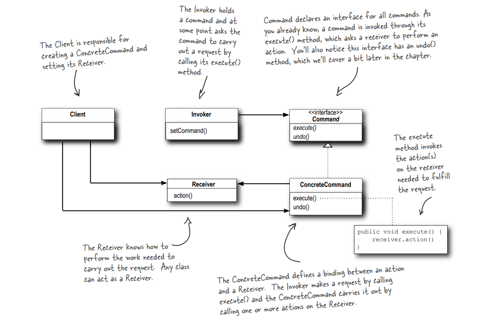

# RemoteControlAPI

## Overview
RemoteControlAPI is a Java project that demonstrates the **Command design pattern** via a remote control simulation. The project enables control of various devices (Light, GarageDoor, Stereo) and supports advanced features such as undo and macro commands (Party Mode). It is designed for educational purposes and can be easily extended to support new devices and commands.

---

## Table of Contents
- [Features](#features)
- [Architecture](#architecture)
- [Class Diagram](#class-diagram)
- [Class and Interface Details](#class-and-interface-details)
- [How It Works](#how-it-works)
- [Extending the Project](#extending-the-project)
- [Example Output](#example-output)
- [Getting Started](#getting-started)
- [References](#references)
- [License](#license)

---

## Features
- **Decoupled Design:** Invoker and receivers are separated for flexibility.
- **Undo Functionality:** Revert the last command executed.
- **Macro Commands:** Execute multiple commands as a batch (e.g., Party Mode).
- **Null Object Pattern:** Avoids null checks for unassigned slots.
- **Extensible:** Easily add new devices and commands.

---

## Architecture

### Design Principles
- **Decoupling:** The Command pattern separates the invoker (remote control) from the receivers (devices), allowing flexible assignment and execution of commands.
- **Extensibility:** New devices and commands can be added with minimal changes to existing code.
- **Undo Support:** Commands encapsulate both execution and undo logic.
- **Macro Commands:** Multiple commands can be grouped and executed together.

---

## Class Diagram

<p align="center">
  
</p>


<p align="center">
  
</p>

---

## Class and Interface Details

### Command.java
- **Type:** Interface
- **Methods:**
  - `void execute()`: Executes the command.
  - `void undo()`: Reverts the command (default: may be empty for some commands).
- **Role:** Base for all command objects. Enables encapsulation of requests as objects, allowing parameterization and queuing of requests.

### Light.java
- **Type:** Receiver
- **Fields:** Internal state (e.g., isOn)
- **Methods:** `void on()`, `void off()`
- **Role:** Represents a light device. Contains the actual business logic for switching the light.

### LightOnCommand.java / LightOffCommand.java
- **Type:** Concrete Command
- **Fields:** `Light light`
- **Methods:** `execute()`, `undo()`
- **Role:** Encapsulates light actions. Implements the Command interface to allow the remote to control the light.

### GarageDoor.java
- **Type:** Receiver
- **Fields:** Internal state (e.g., isOpen)
- **Methods:** `void up()`, `void down()`
- **Role:** Represents a garage door device. Contains the actual business logic for opening/closing the door.

### GarageDoorUpCommand.java / GarageDoorDownCommand.java
- **Type:** Concrete Command
- **Fields:** `GarageDoor garageDoor`
- **Methods:** `execute()`, `undo()`
- **Role:** Encapsulates garage door actions. Implements the Command interface to allow the remote to control the garage door.

### Stereo.java
- **Type:** Receiver
- **Fields:** Internal state (e.g., isOn, volume, mode)
- **Methods:** `void on()`, `void off()`, `void setCD()`, `void setVolume(int level)`
- **Role:** Represents a stereo system. Contains the actual business logic for operating the stereo.

### StereoOnWithCDCommand.java / StereoOffCommand.java
- **Type:** Concrete Command
- **Fields:** `Stereo stereo`
- **Methods:** `execute()`, `undo()`
- **Role:** Encapsulates stereo actions. Implements the Command interface to allow the remote to control the stereo.

### MacroCommand.java
- **Type:** Concrete Command
- **Fields:** `Command[] commands`
- **Methods:** `execute()`, `undo()`
- **Role:** Allows batch execution/undo of commands (e.g., Party Mode). Useful for scenarios where multiple devices need to be controlled together.

### NoCommand.java
- **Type:** Null Object (Concrete Command)
- **Methods:** `execute()`, `undo()`
- **Role:** Used for unassigned remote slots to avoid null checks. Implements the Command interface with empty methods.

### RemoteControl.java
- **Type:** Invoker
- **Fields:** Arrays of on/off commands for each slot.
- **Methods:** `setCommand(int slot, Command onCommand, Command offCommand)`, `onButtonWasPressed(int slot)`, `offButtonWasPressed(int slot)`
- **Role:** Basic remote control for executing commands. Does not support undo.

### RemoteControlWithUndo.java
- **Type:** Invoker
- **Fields:** Tracks last executed command for undo.
- **Methods:** `undoButtonWasPressed()`
- **Role:** Extends RemoteControl to support undo functionality. Remembers the last command executed and allows reverting it.

### Demo.java
- **Type:** Client
- **Role:** Sets up receivers, commands, and remote control. Demonstrates usage, including normal operations, undo, and macro commands.

---

## How It Works

1. **Client** creates receivers and commands.
2. **Client** assigns commands to remote control slots.
3. **User** presses remote buttons, triggering command execution.
4. **Undo** is available for the last command.
5. **MacroCommand** can trigger multiple device actions at once.

### Example Usage

```java
RemoteControlWithUndo remote = new RemoteControlWithUndo();
Light livingRoomLight = new Light();
GarageDoor garageDoor = new GarageDoor();
Stereo stereo = new Stereo();
Command lightOn = new LightOnCommand(livingRoomLight);
Command lightOff = new LightOffCommand(livingRoomLight);
// ...
remote.setCommand(0, lightOn, lightOff);
remote.onButtonWasPressed(0);
remote.undoButtonWasPressed();
```

---

## Extending the Project

To add a new device or command:
1. **Create a Receiver class** (e.g., `Fan.java`).
2. **Implement Command classes** for actions (e.g., `FanOnCommand`, `FanOffCommand`).
3. **Assign commands** to the remote in `Demo.java`.

---

## Example Output

```
Light is ON
Light is OFF
Undo: Light is ON
Stereo is ON with CD
Stereo is OFF
--- Party Mode ---
Light is ON
Stereo is ON with CD
Garage Door is OPEN
Light is OFF
Stereo is OFF
Garage Door is CLOSED
Undo: Light is ON
Undo: Stereo is ON with CD
Undo: Garage Door is OPEN
```

---

## Getting Started

### Prerequisites
- Java 8 or higher
- IDE (e.g., IntelliJ IDEA, Eclipse, VS Code)

### Build & Run

1. **Clone the repository:**
   ```sh
   git clone <repo-url>
   cd command
   ```
2. **Compile the code:**
   ```sh
   javac *.java
   ```
3. **Run the demo:**
   ```sh
   java Demo
   ```

---

## References
- [Head First Design Patterns](https://www.oreilly.com/library/view/head-first-design/0596007124/)
- [Command Pattern - Refactoring Guru](https://refactoring.guru/design-patterns/command)
- [Java Design Patterns](https://java-design-patterns.com/patterns/command/)

---

## License
This project is for educational purposes.
