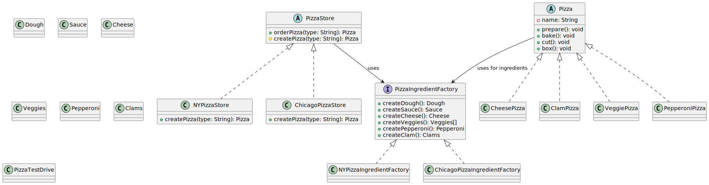

# PizzaStore Project

## Overview
This project demonstrates the Factory Method and Abstract Factory design patterns in Java, using a pizza store simulation. It allows for the creation of different types of pizzas with region-specific ingredients, showcasing extensibility and maintainability in object-oriented design.

## Design Patterns Used
- **Factory Method:** `PizzaStore` is an abstract class that defines the method `createPizza(String type)`. Concrete subclasses (`NYPizzaStore`, `ChicagoPizzaStore`) implement this method to instantiate region-specific pizzas.
- **Abstract Factory:** Ingredient creation is delegated to factories (`PizzaIngredientFactory`, `NYPizzaIngredientFactory`, `ChicagoPizzaIngredientFactory`) to provide region-specific ingredients for pizzas.

## Main Classes
- `PizzaStore` (abstract): Defines the pizza ordering process and factory method.
- `NYPizzaStore`, `ChicagoPizzaStore`: Concrete stores that create pizzas with New York or Chicago style ingredients.
- `Pizza` (abstract): Base class for all pizzas, with methods like `prepare()`, `bake()`, `cut()`, and `box()`.
- `CheesePizza`, `VeggiePizza`, `ClamPizza`, `PepperoniPizza`: Concrete pizza types.
- `PizzaIngredientFactory` (interface): Abstracts ingredient creation.
- `NYPizzaIngredientFactory`, `ChicagoPizzaIngredientFactory`: Concrete factories for region-specific ingredients.
- Ingredient classes: `Dough`, `Sauce`, `Cheese`, `Veggies`, `Clams`, `Pepperoni`.
- `PizzaTestDrive`: Main class to test the pizza store functionality.

## How It Works
1. The client creates a specific `PizzaStore` (e.g., `NYPizzaStore`).
2. The client calls `orderPizza(String type)` to order a pizza.
3. The store uses its factory method to create the appropriate pizza, using its ingredient factory.
4. The pizza is prepared, baked, cut, and boxed, then returned to the client.

## Example Usage
```java
PizzaStore nyStore = new NYPizzaStore();
Pizza pizza = nyStore.orderPizza("cheese");
System.out.println("Ordered a " + pizza.getName());
```

## Extending the Project
- Add new pizza types by creating new subclasses of `Pizza`.
- Add new regions by creating new `PizzaStore` and `PizzaIngredientFactory` implementations.

## Running the Project
1. Compile all Java files in the `src/` directory:
   ```bash
   javac src/*.java -d bin/
   ```
2. Run `PizzaTestDrive` to see sample orders and output:
   ```bash
   java -cp bin PizzaTestDrive
   ```

## UML Class Diagram
<p align="center">
  
</p>


<p align="center">
  
</p>

<p align="center">
  
</p>
