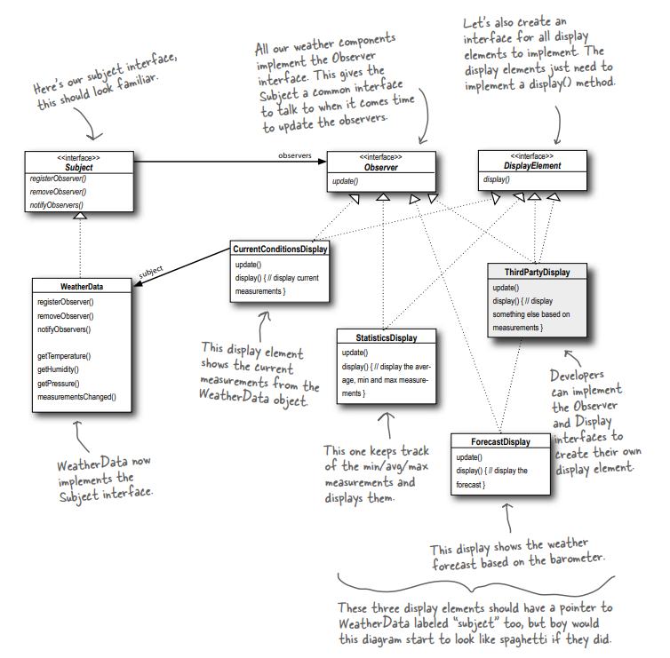

# Observer Design Pattern

## Overview
The Observer design pattern is a behavioral design pattern that defines a one-to-many dependency between objects so that when one object (the subject) changes state, all its dependent objects (observers) are notified and updated automatically. This pattern is useful for implementing distributed event-handling systems, where changes in one object need to propagate to others without tightly coupling them.

### Key Components
- **Subject**: The object that holds the state and notifies observers of any changes.
- **Observer**: The interface or abstract class defining the update method that observers implement.
- **Concrete Subject**: A specific implementation of the subject that maintains state and manages a list of observers.
- **Concrete Observer**: A specific implementation of an observer that reacts to updates from the subject.

### Benefits
- Promotes loose coupling between subject and observers.
- Allows dynamic addition or removal of observers at runtime.
- Supports broadcasting of updates to multiple objects.

### Drawbacks
- Can lead to memory leaks if observers are not properly unregistered.
- Notification to many observers can be time-consuming.
- Observers may rely heavily on the subject's state, creating implicit dependencies.

## Example: Weather Forecasting Application (Head First Design Patterns)

The *Head First Design Patterns* book illustrates the Observer pattern using a weather forecasting application called the **Weather-O-Rama**. This example demonstrates how the pattern is applied in a real-world scenario where weather data changes frequently and multiple displays need to be updated in real-time.

### Scenario
The Weather-O-Rama application monitors weather data (temperature, humidity, and pressure) from a weather station. Various display elements, such as current conditions, statistics, and forecasts, need to be updated whenever new weather measurements are available.

<p align="center">
  
</p>

### Implementation Details
- **Subject**: The `WeatherData` class acts as the subject. It maintains the current weather measurements (temperature, humidity, pressure) and manages a list of observers.
- **Observers**: Display elements (e.g., `CurrentConditionsDisplay`, `StatisticsDisplay`, `ForecastDisplay`) implement the `Observer` interface, which defines an `update` method.
- **Flow**:
  1. The `WeatherData` object receives new measurements from the weather station.
  2. It notifies all registered observers by calling their `update` method, passing the new measurements (temperature, humidity, pressure).
  3. Each observer (display) retrieves the updated data and refreshes its display accordingly.

### Why Use the Observer Pattern?
In this application, the Observer pattern is ideal because:
- The displays are loosely coupled to the `WeatherData` subject. New display types can be added without modifying the `WeatherData` class.
- Observers can be added or removed dynamically (e.g., a new display can subscribe to updates at runtime).
- The system ensures that all displays are updated automatically when new weather data is available, maintaining consistency.

### Example Workflow
1. The weather station updates the `WeatherData` object with new measurements (e.g., temperature = 72°F, humidity = 65%, pressure = 29.92 inHg).
2. `WeatherData` calls the `notifyObservers` method, which iterates through its list of observers.
3. Each observer's `update` method is invoked with the new measurements.
4. The `CurrentConditionsDisplay` shows the current temperature and humidity, the `StatisticsDisplay` updates metrics like average temperature, and the `ForecastDisplay` predicts future weather based on pressure trends.

### Code Structure (Conceptual)
Below is a simplified pseudocode representation of the Weather-O-Rama application:

```java
// Observer interface
interface Observer {
    void update(float temperature, float humidity, float pressure);
}

// Subject interface
interface Subject {
    void registerObserver(Observer o);
    void removeObserver(Observer o);
    void notifyObservers();
}

// Concrete Subject
class WeatherData implements Subject {
    private List<Observer> observers;
    private float temperature, humidity, pressure;

    public WeatherData() {
        observers = new ArrayList<>();
    }

    public void registerObserver(Observer o) {
        observers.add(o);
    }

    public void removeObserver(Observer o) {
        observers.remove(o);
    }

    public void notifyObservers() {
        for (Observer o : observers) {
            o.update(temperature, humidity, pressure);
        }
    }

    public void measurementsChanged() {
        notifyObservers();
    }

    public void setMeasurements(float temperature, float humidity, float pressure) {
        this.temperature = temperature;
        this.humidity = humidity;
        this.pressure = pressure;
        measurementsChanged();
    }
}

// Concrete Observer
class CurrentConditionsDisplay implements Observer {
    private float temperature, humidity;

    public void update(float temperature, float humidity, float pressure) {
        this.temperature = temperature;
        this.humidity = humidity;
        display();
    }

    public void display() {
        System.out.println("Current conditions: " + temperature + "F, " + humidity + "% humidity");
    }
}
```

### Key Takeaways from the Example
- The `WeatherData` class doesn't need to know the details of each display, only that they implement the `Observer` interface.
- New display types (e.g., a mobile app display) can be added without changing the `WeatherData` class, adhering to the **Open/Closed Principle**.
- The pattern supports scalability, as multiple displays can subscribe to the same weather data updates.

## Usage
The Observer pattern is commonly used in scenarios where:
- Multiple objects need to react to state changes in another object (e.g., GUI frameworks, event listeners).
- You want to decouple the data source from its consumers.
- Examples include publish-subscribe systems, real-time data feeds, and user interface updates.

## Conclusion
The Observer pattern is a powerful tool for managing dependencies in dynamic systems like the Weather-O-Rama application. By allowing loose coupling and dynamic updates, it enables flexible and maintainable designs for event-driven applications.