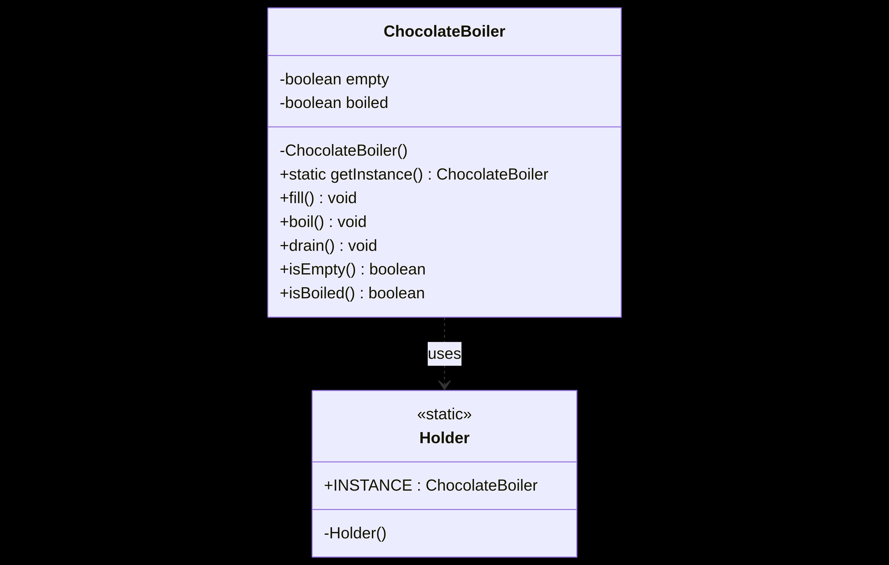

# ChocolateBoiler Project

## Overview
This project demonstrates the Singleton design pattern in Java through a simulation of a chocolate boiler. The Singleton pattern ensures that only one instance of the ChocolateBoiler class exists throughout the application's lifecycle, providing a global point of access to the instance. This is useful in scenarios where a single resource must be managed consistently, such as hardware controllers or shared resources.

## Design Pattern Used
- **Singleton:**
  - Restricts instantiation of a class to one object.
  - Provides a static method (`getInstance()`) to access the unique instance.
  - Ensures thread safety using `synchronized` in the instance getter.

## Main Classes
### ChocolateBoiler
- Implements the Singleton pattern.
- Manages the state of the boiler (`empty`, `boiled`).
- Methods:
  - `fill()`: Fills the boiler with chocolate and milk if empty.
  - `boil()`: Boils the mixture if filled and not yet boiled.
  - `drain()`: Drains the boiled mixture if ready.
  - `isEmpty()`: Checks if the boiler is empty.
  - `isBoiled()`: Checks if the mixture is boiled.
- Private constructor prevents direct instantiation.
- Static `getInstance()` method ensures only one instance exists.

### ChocolateBoilerTest
- Demonstrates the Singleton usage.
- Shows that multiple calls to `getInstance()` return the same object.
- Simulates typical boiler operations and prints status messages.

## How It Works
1. The client calls `ChocolateBoiler.getInstance()` to obtain the singleton instance.
2. The client uses the instance to fill, boil, and drain the boiler.
3. Any subsequent calls to `getInstance()` return the same object, ensuring only one boiler exists.
4. The boiler's state is managed safely and consistently.

## Example Usage
```java
ChocolateBoiler boiler1 = ChocolateBoiler.getInstance();
boiler1.fill();
boiler1.boil();
boiler1.drain();

ChocolateBoiler boiler2 = ChocolateBoiler.getInstance();
// boiler1 and boiler2 refer to the same instance
System.out.println(boiler1 == boiler2); // true
```
<p align="center">
  
</p>


## Thread Safety
- The `getInstance()` method is synchronized to prevent race conditions in multi-threaded environments.
- This ensures that only one instance is created, even if multiple threads access it simultaneously.

## Benefits
- Guarantees a single instance of ChocolateBoiler.
- Centralizes control and state management.
- Prevents resource conflicts and inconsistent states.
- Easy to maintain and extend.

## Limitations
- Synchronized access may impact performance in highly concurrent scenarios.
- Singleton can make unit testing harder due to global state.

## Running the Project
1. Compile all Java files in the `src/` directory:
   ```bash
   javac src/*.java -d bin/
   ```
2. Run the test class:
   ```bash
   java -cp bin ChocolateBoilerTest
   ```

## Documentation
- The `ChocolateBoiler` class is documented with Javadoc comments describing its purpose, usage, and methods.
- See `src/ChocolateBoiler.java` for details.

## License
This project is for educational purposes and demonstrates the Singleton design pattern in Java.